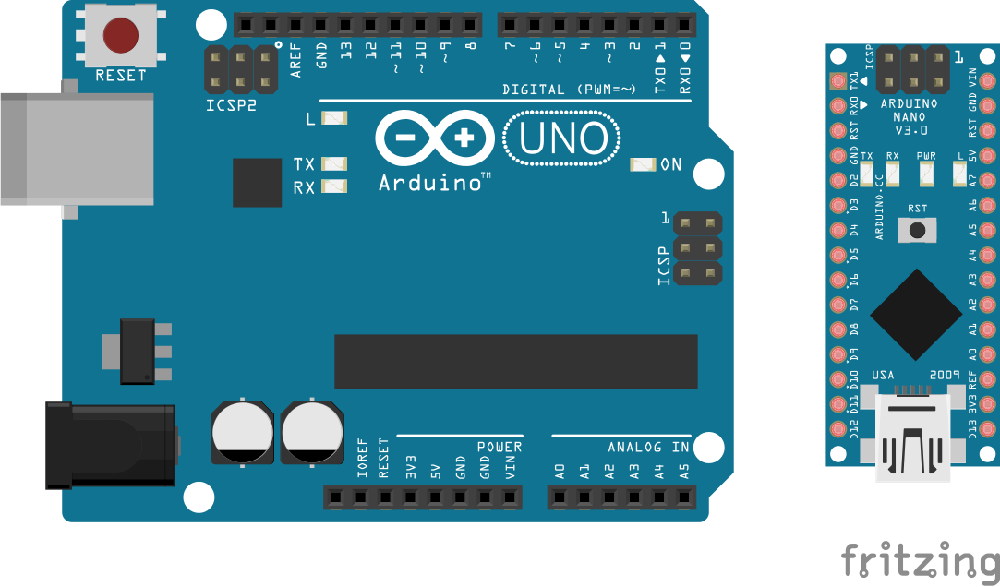
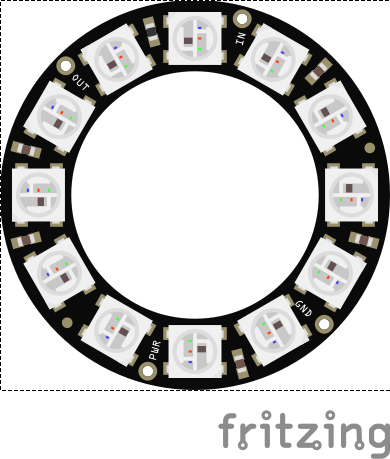
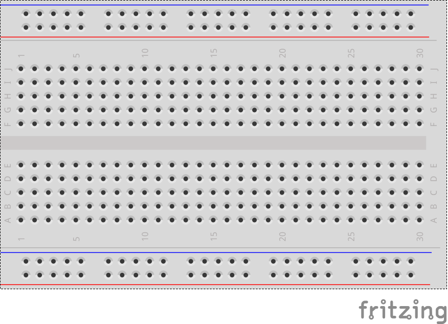

# Jugend Hackt Animations-Workshop

Hier findet ihr eine Arduino Bibliothek mit Beispielen und Erklärungen rund um das Programmieren von Animationen mit dem Arduino und WS2812 LEDs.
Ihr könnt dieses Projekt verwenden um euch selbst, Schritt für Schritt, den Umgang mit Arduinos und LEDs beizubringen oder um einfach noch einmal nachzuschauen wie bestimmte Dinge funktionieren.
Wir fangen hier ganz von vorne an und ihr müsst keine Vorkenntnisse mit bringen. Wenn ihr schon alte Hasen seid und viel Erfahrung mit bringt dann könnt ihr auch die ersten Schritte überspringen und gleich mit den Animationen los legen.
Die ersten Schritte werden sich mit der Installation der Arduino IDE und den benötigten libraries beschäftigen. Danach werden wir ein Bisschen Grundlagenwissen zur Programmierung aufbauen, damit wir in den späteren Schritten auch verstehen was wir da eigentlich so tun.
Dann schauen wir uns kurz an wie das mit so einer LED funktioniert und was das eigentlich ist, bevor wir dann richtig los legen und tolle Animationen basteln können.

## Was ihr braucht

Um hier mit zu machen braucht ihr nicht viel.

* Arduino (Nano/Uno)

* Neopixel oder ws2812 Ring

* Steckbrett (Breadboard)

* Männlich auf Männlich Jumper Wires

## Was wir tun

Das Projekt ist aufgeteilt in verschiedene Kapitel in denen wir uns jeweils bestimmte Sachen ganz genau anschauen und dabei sehen wie diese funktionieren. Für jedes neue Thema gibt es ein oder mehrere Beispiele in Form von sogenannten Sketches.
Die Sketches könnt ihr auf euren Arduino laden und dann schauen was passiert. Ihr könnt sie aber auch modifizieren und damit experimentieren und unter eurem eigenen Namen abspeichern und so eure eigenen Ideen verwirklichen.
Wenn mal etwas nicht mehr funktioniert und ihr nicht wisst warum könnt ihr die Beispiel Sketches jeder Zeit einfach neu laden.

Wir schauen uns im Kapitel [Setup](doc/Setup.md) zuerst an welche Software wir brauchen, welche Bibliotheken wir herunter laden müssen und wie wir den Arduino anschließen. Wir schauen uns auch an was ein Sketch ist und wie wir einen Sketch auf den Arduino bekommen.

Im Kapitel [Grundlagen](doc/Grundlagen.md) schauen wir uns ganz genau an wie bestimmte Grundlagen beim Programmieren funktionieren. Das Kapitel ist dazu gedacht, dass ihr immer wieder genau nachschauen könnt wie bestimmte Dinge wie Arrays, Bedingungen oder Schleifen funktionieren. Ihr werdet auch immer wieder Links zu bestimmten Themen in diesem Kapitel finden, wenn wir sie das erste Mal verwenden. Also müsst ihr nicht gleich damit anfangen, aber wenn es euch interessiert könnt ihr natürlich gleich damit los legen.

Im Kapitel [Von Farben und Physik](doc/Farben.md) schauen wir uns an wie wir Farben mit unseren LEDs erzeugen können. Dabei geht es um die Grundfarben und wie man diese mischen kann. Wir schauen uns aber auch an wie man verschiedene LEDs einfärben kann.

Im Kapitel [Animationen](doc/Animation.md) verwenden wir unser Wissen aus den vorhergehenden Kapiteln um Animationen zu erzeugen. Also wie wir mit Hilfe von farbig leuchtenden LEDs die Illusion einer Bewegung erzeugen können. Klingt das nicht spannend?

* [Setup](doc/Setup.md)
* [Grundlagen](doc/Grundlagen.md)
* [Von Farben und Physik](doc/Farben.md)
* [Animationen](doc/Animation.md)
