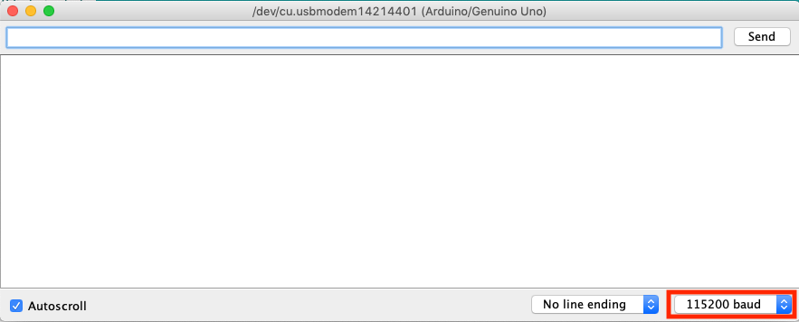
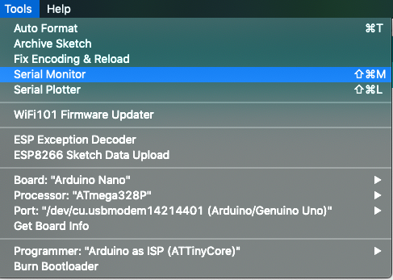
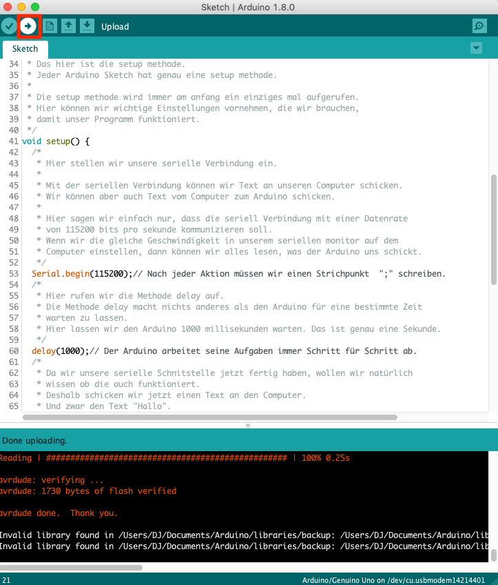

# Die Grundlagen

Hier schauen wir uns schritt für Schritt an wie Programmieren mit einem Arduino funktioniert und wie wir ihm beibringen können Dinge für uns zu erledigen. Denn das ist was Programmieren im wesentlichen bedeutet. Wir wollen, dass ein Computer Dinge für uns erledigt. Nun schauen wir uns an wie wir soetwas machen können.

Alles was mit Programmieren zu tun hat hat irgendwie mit Werten zu tun. Diese Werte können wir *Lesen*, *Speichern* oder *Modifizieren*.
Das ist eigentlich alles was wir beim Programmieren tun.

Als Beispiel möchten wir, dass der Arduino eine LED einschaltet, wenn es Dunkel wird.
Dazu schließen wir eine LED und einen Helligkeitssensor an den Arduino an.
Wir *lesen* den Wert des Helligkeitssensors aus. Abhängig von dem Wert *modifizieren* wir den Wert für die Helligkeit der LED und *speichern* den Wert damit die LED diese eingestellte Helligkeit beibehält.

Klingt ja alles garnicht so schwer. Ist es auch nicht. Jetzt schauen wir uns einfach schritt für schritt an wie man Werte
*Lesen* und *Speichern* kann und wie man sie *Modifiziert*.

# Ausgabe von Werten

Damit wir sehen können was auf dem Arduino passiert müssen wir irgendwie mit unserem Computer reden können.
Der Arduino ist ja ein eigenständiger kleiner Computer und kann seine Aufgaben völlig alleine ausführen.
Dazu muss er nicht an einen Computer angeschlossen sein, er braucht dafür nur eine stabile Spannungsversorgung von 5 Volt.
Da unser Arduino kein Display hat können wir auch nicht sehen was gerade passiert. Aus diesem Grund gibt es beim Arduino die Möglichkeit Werte an den Computer zu schicken.
Dazu verwendet der Arduino eine serielle Schnittstelle. Der Arduino schickt uns dann Daten über das USB-Kabel an den Computer.

Schauen wir uns an wie das Ganze funktioniert.
Zuerst müssen wir unsere serielle Schnittstelle richtig einstellen.
Wir erinnern uns, dass jeder Sketch für einen Arduino hat eine `setup()` Methode und eine `loop()` Methode hat.
Einstellungen die für den ganten Sketch gelten nehmen wir in der `setup()` Methode vor, denn sie wird immer als erstes ausgeführt und wir wollen unsere serielle Schnittstelle ganz am Anfang richtig einstellen.
Also schauen wir doch mal so eine `setup()` Methode an.

``` C++
void setup() {
  Serial.begin(115200);
}
```

Hier seht ihr unsere `setup()` methode.
Die Zeile `void setup()` sag dem Arduino, dass die `setup()` Methode hier beginnt.
Alles was zwichen den zwei Klammern `{` und `}` steht ist dann ein Teil der `setup()` Methode und der Arduino weiss dadurch,
dass er alle Befehle zwischen diesen beiden Klammern ganz am Anfang ausführen muss.

Der Inhalt unserer `setup()` Methode ist `Serial.begin(115200)`. Das ist also alles was der Arduino in der `setup()` Methode ausführen muss. Aber was genau macht das jetzt.
Diese Zeile sagt unserem Arduino, dass er die serielle Schnittstelle benutzen soll. Ist ja auch logisch `Serial.begin` heisst ja so viel wie Seriell.anfangen. Aber was bedeutet diese Zahl zwichen den Klammern `(` und `)`?
Damit stellen wir die Übertragungsrate der seriellen Verbindung ein. Was das genau bedeutet ist erstmal garnicht wichtig. Es ist nur wichtig, dass wir an unserem Computer im Seriellen Monitor die gleiche Übertragungsrate einstellen.



Den Seriellen Monitor könnt ihr so öffnen.



Nach dem wir die Serielle Schnittstelle eingestellt haben können wir in unserer `loop()` Methode daten an den Computer schicken.
Schauen wir uns an wie das funktioniert.

``` C++
void loop() {
  Serial.println("Das ist ein Text");
}
```

Wollen wir Text an unseren Computer schicken könne wir das ganz einfach tun indem wir der seriellen Schnittstelle sagen was wir schicken wollen. Es gibt einmal die Methode `print()`, was so viel heißt wie Drucken und die Methode `println()` was so viel heißt wie Zeile Drucken.
Das bedeutet dass Daten die wir mit der Methode `println()` ausgeben am Ende immer eine neue Zeile erzeugen. Daten die wir mit der Methode `print()` drucken erzeugen am Ende keine neue Zeile.

Wenn wir Texte an den Computer schicken wollen, dann können wir die Texte in Anführungszeichen zwischen die zwei Klammern `(` und `)` schreiben.
In unserem Beispiel schickt der Arduino also den Text `Das ist ein Text` an unseren Computer.

Das können wir aber auch mit Zahlen machen.

``` C++
void loop() {
  Serial.println(12345);
}
```

Hier schicken wir die Zahl `12345` an unseren Computer. Soweit ja ganz einfach.
Wir können auch beides in einer Zeile schreiben. Dazu müssen wir die Aufrufe kombinieren.

``` C++
void loop() {
  Serial.print("Hallo Zahl: ");
  Serial.print(42);
  Serial.println();
}
```

Was passiert hier? Mit dem Befehl `Serial.print("Hallo Zahl ");` Schicken wir den Text `"Hallo Zahl: "` an unseren Computer, ohne die Zeile Abzuschließen. Danach schicken wir die Zahl `42` an unseren Computer, ohne die Zeile Abzuschließen.
Der letzte Befehl `Serial.println()` schickt nichts an den Computer und schließ nur unsere Zeile ab.

### Beispiel

Schauen wir uns das Beispiel Ausgabe an. Öffnet dazu den Beispielsketch `Datei|Beispiele|Jugend Hackt Animation-lib|Variablen`.

``` C++

/*
   Hier ist wieder unsere Setup Methode.
*/
void setup() {
  Serial.begin(115200);// Wir stellen unsere Übertragungsrate ein.
}

/*
   Hier führen wir Berechungen aus und schicken die Ergebnisse an den Computer.
*/
void loop() {
  Serial.print("Hallo Zahl: "); // Wir geben einen Text aus ohne eine neue Zeile am Ende
  Serial.print(42); // Wir geben eine Zahl aus ohne neue Zeile am Ende
  Serial.println(); // Wir geben nichts aus, aber erzeugen eine neue Zeile
  delay(1000); // Wir warten eine Sekunde.
}
```

Hier seht ihr wie das in einem ganzen Sketch aussieht. Ladet den Sketch aud euren Arduino indem ihr den Upload Knopf drückt.



Wenn ihr den Seriellen Monitor öffnet könnt ihr nun die Ausgabe anschauen.
Gebt doch euren eigenen Text aus, fügt einen neuen Text hinzu oder spielt damit wann ihr eine neue Zeile erzeugt.
Wir sehen uns im nächsten Kapitel.

# Variablen

Wenn wir programmieren, dann arbeiten wir oft mit Werten. Wir speichern diese Werte oder möchten sie verändern.
Stellt euch zum Beispiel vor ihr möchtet die Helligkeit einer LED verändern. Dann müsst ihr dem Arduino ja auch irgendwie
sagen wie hell die LED sein soll.

Dafür gibt es Variablen. Variablen sind so etwas wie Namen für Werte.
Stellt euch Variablen als Namen für Werte vor. Wir müssen dem Arduino am Anfang sagen dass es diese Variable gibt und für was der Name steht. Das nennt sich eine Variable deklarieren.

``` C++
int a;
```

Hier sagen wir dem Arduino Dass es eine Variable mit dem Namen `a` gibt, die Ganzzahlige Werte speichern kann.
Diese Ganzzahlwerte werden auch Integer (kurz `int`) genannt. Also sowas wie `1` oder `5` oder `1337`.
Aber bis jetzt hat diese Variable noch keinen Wert gespeichert. Das lösen wir ganz einfach.

``` C++
a = 5;
```

Hier sagen wir dem Arduino, dass die Variable `a` jetzt den Wert `5` hat. Da der Arduino schon weiss, dass `a` eine Ganzzahl (`int`) ist, müssen wir ihm dass nicht noch einmal sagen. Ist doch ganz einfach oder?
Da wir Informatiker faule Menschen sind haben wir uns überlegt, dass das doch viel Schreibarbeit ist, deshalb kann man das auch in einer Zeile zusammenfassen.

``` C++
int a = 5;
```

Ganz witzig wird es, wenn wir mehrere Variablen haben. Was passiert denn wenn ich sowas hier machen würde?

``` C++
int a = 5;
int b = a;
```

Zu erst einmal haben wir jetzt eine Variable `a` mit dem Wert `5`. Soweit alles wie zuvor.
In der zweiten Zeile deklarieren wir jetzt eine zweite Variable mit dem Namen `b` und weißen ihr den Wert von `a` zu.
Wichtig ist hier, dass links vom `=` immer die Variable steht, die einen neuen Wert bekommt.
Rechts vom `=` steht immer der Wert, den die Variable bekommt, in diesem Fall den Wert von `a`, also `5`.

Wichtig ist, dass wir eine Variable immer zuerst deklarieren müssen, bevor wir sie verwenden, da der Arduino ja sonst nicht weiss, dass es diese Variable gibt, oder welchen Typ sie hat.
Und wenn ihr euch noch an das letzte Kapitel erinnert, dann arbeitet der Arduino alle Befehle von oben nach unten der Reihe nach ab. Also muss die Deklaration der Variable immer über der ersten Verwendung stehen.

### Beispiel

Jetzt wissen wir ja wie das funktioniert und können uns das Beispiel dazu genauer anschauen.
Öffnet zuerst den Beispielsketch Variablen `Datei|Beispiele|Jugend Hackt Animation-lib|Variablen`.
Es öffnet sich ein neues Fenster mit Programmcode, den wir uns nun etwas genauer anschauen werden.

``` C++
/*
   Hier ist wieder unsere Setup Methode.
*/
void setup() {
  Serial.begin(115200);// Wir stellen wieder unsere Übertragungsrate ein.
  delay(1000);// Dann warten wir eine Sekunde.
  Serial.println("Was sind Variablen");// Nun schicken wir den Begrüßungstext an den Computer.
}

/*
   Hier führen wir Berechungen aus und schicken die Ergebnisse an den Computer.
*/
void loop() {
  int a; // Wir deklarieren eine Variable vom Typ Integer (int), was Ganzzahl bedeutet.
  /*
     Eine Variable ist sowas wie ein Name für einen Wert, so können wir den Wert immer wieder
     mit seinem Namen abrufen und verwenden.
     Wenn wir eine Variable deklarieren, müssen wir immer einen Typ angeben, damit der Arduino weiss,
     was für ein Typ sich hinter dem Namen verbirgt.
  */
  a = 5; // Nun weisen wir der Variable den Wert 5 zu.
  /*
     Wenn wir einer Variable einen Wert zuweisen müssen wir den Typ nicht mehr angeben, denn
     der Arduino hat sich diesen bereits gemerkt.
  */
  Serial.print("Variable a hat den Wert: "); // Wir schicken einen Text an den Computer ohne die Zeile zu beenden.
  Serial.println(a); // Wir schicken den Wert der Variablen an den Computer und beenden die Zeile
  /*
     Da wir oben eine Ganzzahl Variable deklarieren haben und ihr einen Wert zugewiesen haben weiss der Arduino,
     dass er diesen Ganzzahl Wert an den Computer schicken soll.
  */
  delay(1000); // Wir warten eine Sekunde.

  int b = 10; // Wir können auch eine Variable deklarieren und ihr gleich einen Wert zuweisen.
  Serial.print("Variable b hat den Wert: ");
  Serial.println(b);
  delay(1000); // Wir warten eine Sekunde.

  b = 15; // Wir können den Wert der Variable auch verändern.
  Serial.print("Variable b hat den Wert: ");
  Serial.println(b);

  delay(30000); // Wir warten 30 Sekunden.
}
```

Das scheint erstmal etwas viel aber eigentlich ist es ganz einfach.
Die `setup()` methode kennt ihr ja schon. Hier stellen wir alles so ein, dass wir mit dem Computer reden können.

``` C++
void setup() {
  Serial.begin(115200);// Wir stellen wieder unsere Übertragungsrate ein.
  delay(1000);// Dann warten wir eine Sekunde.
  Serial.println("Ganzzahl Mathematik");// Nun schicken wir den Begrüßungstext an den Computer.
}
```

Die `loop()` methode sieht jetzt etwas anderst aus, aber das ist ganz normal, wir wollen ja auch was anderes tun.
Wir deklarieren zuerst eine ganzzahlige Variable (`int`) `a`, weißen ihr einen Wert zu und schicken diesen Wert an den Computer.

``` C++
  int a; // Wir deklarieren eine Variable vom Typ Integer (int), was Ganzzahl bedeutet.
  /*
     Eine Variable ist sowas wie ein Name für einen Wert, so können wir den Wert immer wieder
     mit seinem Namen abrufen und verwenden.
     Wenn wir eine Variable deklarieren, müssen wir immer einen Typ angeben, damit der Arduino weiss,
     was für ein Typ sich hinter dem Namen verbirgt.
  */
  a = 5; // Nun weisen wir der Variable den Wert 5 zu.
  /*
     Wenn wir einer Variable einen Wert zuweisen müssen wir den Typ nicht mehr angeben, denn
     der Arduino hat sich diesen bereits gemerkt.
  */
  Serial.print("Variable a hat den Wert: "); // Wir schicken einen Text an den Computer ohne die Zeile zu beenden.
  Serial.println(a); // Wir schicken den Wert der Variablen an den Computer und beenden die Zeile
  /*
     Da wir oben eine Ganzzahl Variable deklarieren haben und ihr einen Wert zugewiesen haben weiss der Arduino,
     dass er diesen Ganzzahl Wert an den Computer schicken soll.
  */
  delay(1000); // Wir warten eine Sekunde.
```

Ist doch alles garnicht so kompliziert wie es am Anfang aussieht.
Im nächsten Schritt deklarieren wir die ganzzahlige Variable (`int`) `b` und weißen ihr einfach direkt einen Wert zu und schicken das dann an den Computer.

``` C++
  int b = 10; // Wir können auch eine Variable deklarieren und ihr gleich einen Wert zuweisen.
  Serial.print("Variable b hat den Wert: ");
  Serial.println(b);
  delay(1000); // Wir warten eine Sekunde.
```

Das ist alles garnicht so schwer. Aber was ist wenn wir zum Beispiel den Wert von `b` später verändern wollen?
Das ist gar kein Problem. Hier verändern wir einfach den Wert für `b` und schicken ihn wieder an den Computer.

``` C++
  b = 15; // Wir können den Wert der Variable auch verändern.
  Serial.print("Variable b hat den Wert: ");
  Serial.println(b);
```

Mit dem Upload Knopf könnt ihr den neuen Sketch auf den Arduino laden und euch im Seriellen Monitor die Ausgaben anschauen.
Was erwartet ihr und stimmen die Resultate mit euren Erwartungen überein?

Spielt doch ein wenig mit den Werten herum und schaut was passiert. Was passiert denn zum Beispiel wenn ihr den Wert von `a` nachträglich verändert und wieder an den Computer schickt, oder eine neue Variable mit einem anderen Wert erzeugt und diese an den Computer schickt. Was würde denn passieren, wenn ihr diese Zeilen noch in der loop methode hinzu fügt?

``` C++
  int c = a;
  Serial.print("Variable c hat den Wert: ");
  Serial.println(c);
```

Wir sehen uns im nächsten Kapitel wieder.


## Die Mathematik

Ja wir müssen uns auch ein bisschen mit Mathematik beschäftigen. Aber keine Angst, es wird garnicht so kompliziert wie einige von euch jetzt vielleicht befürchten. Wenn wir uns mit dem Programmieren beschäftigen heisst es aber immer, dass wir uns auch mit Mathematik beschäftigen. Ein Computer wird ja auch Rechner genannt und das hat auch seine Gründe.

Im Wesentlichen ist ein Computer eine Maschiene, die Rechenaufgaben lösen kann. Das bedeutet auch, dass hinter jedem Pixel auf eurem Monitor Rechenaufgaben versteckt sind, die euer Computer lösen muss, damit am Ende Bilder entstehen oder Text angezeigt wird.
Ist es nicht faszinierend, dass wir aus einfacher Mathematik, Zahlen und Rechenaufgaben, Texte erzeugen können, oder Bilder Entstehen lassen, ja sogar ganze virtuelle Welten erschaffen können?

Bevor wir uns also Animationen und Farben anschauen werfen wir einen wirklich kurzen Blick auf die Mathematik, die hinter diesem ganzen faszinierenen System steckt.

### Beislpiel: Rechenergebnisse speichern

Ein Computer ist ja im wesentlichen ein Gerät um Berechnungen auszuführen. Aber wie funktioniert sowas denn?
Wir erinnern uns an die Variablen aus dem letzten Kapitel. Da haben wir ganzzahligen Variablen Werte zugewießen.
Mit der Mathematik können wir jetzt noch viel mehr mit diesen Variablen tun. Zum Beispiel können wir Ergebnisse von Rechenaufgaben in variablen speichern.


``` C++
int a = 5 + 5;
```

Die Variable `a` speichert jetzt das Ergebnis der Rechenaufgabe `5+5`. Ist ja alles garnicht so kompliziert.

Was kann so ein Computer denn alles berechnen?
Eigentlich kann man mit einem Computer so ziemlich alles berechnen. Wir bleiben aber erstmal bei den einfachen Rechenoperationen.

* **Addition** `+`
* **Subtraktion** `-`
* **Multiplikation** `*`
* **Division** `/`

Für den Arduino können wir das dann so aufschreiben:

``` C++
int add = 5+5;
int sub = 6-3;
int mul = 2*2;
int div = 8/2;
```

Wir haben hier die Variable mit dem Namen `add`, die das Ergebnis der Rechenaufgabe `5+5` speichert.
Wir haben die Variable mit dem Namen `sub`, die das Ergebnis der Rechenaufgaber `6-3`speichert.
Die Variable mit dem Namen `mul` speicher das Ergebnis der Multiplikation `2*2`.
Und die Variable mit dem Namen `div` speichert das Ergebnis der Division `8/2`.

Wenn wir den Sketch `Rechenergebnisse` laden `Datei|Beispiele|Jugend Hackt Animation-lib|Rechenergebnisse` könne wir die Rechenoperationen ausführen und uns die Ergebnisse ausgeben lassen.

``` C++
/*
   Hier ist wieder unsere Setup Methode.
*/
void setup() {
  Serial.begin(115200);// Wir stellen wieder unsere Übertragungsrate ein.
  delay(1000);// Dann warten wir eine Sekunde.
  Serial.println("Ganzzahl Mathematik");// Nun schicken wir den Begrüßungstext an den Computer.
}

/*
   Hier führen wir Berechungen aus und schicken die Ergebnisse an den Computer.
*/
void loop() {
  int add = 5+5; // Die Variable add speichert das Ergebnis der Addition 5+5.
  int sub = 6-3; // Die Variable sub speichert das Ergebnis der Subtraktion 6-3.
  int mul = 2*2; // Die Variable mul speichert das Ergebnis der multiplikation 2*2.
  int div = 8/2; // Die Variable div speichert das Ergebnis der Division 8/2.
  /*
     Nun schicken wir einfach alle Ergebnisse an den Computer.
  */
  Serial.print("Variable add hat den Wert: ");
  Serial.println(add);
  delay(1000);
  Serial.print("Variable sub hat den Wert: ");
  Serial.println(sub);
  delay(1000);
  Serial.print("Variable mul hat den Wert: ");
  Serial.println(mul);
  delay(1000);
  Serial.print("Variable div hat den Wert: ");
  Serial.println(div);
  delay(1000);
  delay(30000); // Wir warten 30 Sekunden.
}
```

Zuerst deklarieren wir die Variablen und weisen ihnen ihre Werte zu.

``` C++
  int add = 5+5; // Die Variable add speichert das Ergebnis der Addition 5+5.
  int sub = 6-3; // Die Variable sub speichert das Ergebnis der Subtraktion 6-3.
  int mul = 2*2; // Die Variable mul speichert das Ergebnis der multiplikation 2*2.
  int div = 8/2; // Die Variable div speichert das Ergebnis der Division 8/2.

```

Dann schicken wir die gespeicherten Werte an unseren Computer.

``` C++
  Serial.print("Variable add hat den Wert: ");
  Serial.println(add);
  delay(1000);
  Serial.print("Variable sub hat den Wert: ");
  Serial.println(sub);
  delay(1000);
  Serial.print("Variable mul hat den Wert: ");
  Serial.println(mul);
  delay(1000);
  Serial.print("Variable div hat den Wert: ");
  Serial.println(div);
  delay(1000);
  delay(30000); // Wir warten 30 Sekunden.
```

Soweit eigentlich ganz einfach.

Mit dem Upload knopf könnt ihr diesen Sketch wieder auf den Arduino laden und ausführen.
Die Ergebnisse der Berechnungen zeigt euch wieder der Serielle Monito an.

### Beispiel: Rechnen mit Variablen

Aber das was wir bisher gemacht haben hätten wir ja eigentlich auch selbst ausrechnen und gleich direkt aufschreiben können.
Interessant wird es, wenn wir anfangen mit den Werten von variablen zu rechnen.

Schauen wir uns doch mal dieses Beispiel an:

``` C++
int a = 5;

int b = a + 1;
int c = a - 1;
```

Was wir hier tun ist ganz einfach, wir deklarieren eine Variable `a` mit dem Wert 5.
In der Variable `b` speichern wir das Ergebnis von `a + 1` also `5+1` und in der Variable `c` das Ergebnis von `a - 1` also `5+1`.
Alles garnicht so kompliziert.

Wir können das ganze auch nur mit Variablen machen:

``` C++
int a = 5;
int b = 10;

int c = a + b;
int d = b - a;
```

Eigentlich ganz einfach. Wir haben die Variable `a` mit dem Wert `5` und die Variable `b` mit dem Wert `10`.
Die Variable `c` speichert das Ergebnis von `a + b`, was ja `5 + 10` ist, also `15`.
Die Variable `d` speichert das Ergebnis von `b - a`, was `10 - 5` ist, also `5`.


Öffnet den Sketch Rechenergebnisse über `Datei|Beispiele|Jugend Hackt Animation-lib|RechnenMitVariablen` und schaut euch den Quelltext etwas genauer an. Was denkt ihr sind die Ausgaben für `c`, `d`, `e`, `f`, `g`, `h`, `i` und `j`?

``` C++
/*
   Hier ist wieder unsere Setup Methode.
*/
void setup() {
  Serial.begin(115200);// Wir stellen wieder unsere Übertragungsrate ein.
  delay(1000);// Dann warten wir eine Sekunde.
  Serial.println("Rechnen mit Variablen");// Nun schicken wir den Begrüßungstext an den Computer.
}

/*
   Hier führen wir Berechungen aus und schicken die Ergebnisse an den Computer.
*/
void loop() {
  int a = 5;
  int b = 10; 

  int c = a + 1;
  int d = a - 1;
  int e = a + b;
  int f = b - a;
  int g = b / a;
  int h = a * a;
  int i = a + a * b;
  int j = a / 2;
  /*
     Nun schicken wir einfach alle Ergebnisse an den Computer.
  */
  Serial.print("Variable c hat den Wert: ");
  Serial.println(c);
  delay(1000);
  Serial.print("Variable d hat den Wert: ");
  Serial.println(d);
  delay(1000);
  Serial.print("Variable e hat den Wert: ");
  Serial.println(e);
  delay(1000);
  Serial.print("Variable f hat den Wert: ");
  Serial.println(f);
  delay(1000);
  Serial.print("Variable g hat den Wert: ");
  Serial.println(g);
  delay(1000);
  Serial.print("Variable h hat den Wert: ");
  Serial.println(h);
  delay(1000);
  Serial.print("Variable i hat den Wert: ");
  Serial.println(i);
  delay(1000);
  Serial.print("Variable j hat den Wert: ");
  Serial.println(j);
  delay(1000);
  delay(30000); // Wir warten 30 Sekunden.
}
```

Drückt den Upload knopf und schaut euch die Ergebnisse an. Stimmen sie mit dem überein was ihr euch überlegt habt?

Was passiert denn genau?

``` C++
  int c = a + 1;
  int d = a - 1;
```

Hier addieren oder subtrahieren wir einfach den wert `1` von `a` , also `5 + 1` und `5 - 1`.

``` C++
  int e = a + b;
  int f = b - a;
```

Auch hier ist es noch recht einfach, wir addieren einfach `a` und `b,` also `5 + 10` oder ziehen `a` von `b` ab, also `10 - 5`.

``` C++
  int g = b / a;
  int h = a * a;
```

Wir können das auch mit multiplikationen machen `b / a` is also `10 / 5`, also `2`.
Wir können auch die gleiche Variable mit sich selbst verrechnen also `a * a` ist `5 * 5` was `25` ergibt.

``` C++
  int i = a + a * b;
```

Auch komplexere Berechnungen sind möglich.
`a + a * b` ist also `5 + 5 * 10` und auch hier gilt Punkt vor Strich, also `5 + 50` was dann schlussendlich `55` ergibt.

Aber was passiert denn hier?

``` C++
  int j = a / 2;
```

Wir haben ja gesehen, dass `a / 2` eigentlich `5 / 2` ergeben sollte und würden erwarten, dass am Ende `2.5` (ja Fließkommazahlen am Computer haben einen `.` anstatt ein `,`) ergibt.
Warum sagt der Arduino aber, dass das Ergebnis von `a / 2`, also `5 / 2` die Zahl `2` ergibt?
Das Problem an der Sache ist, dass wir dem Arduino gesagt haben, dass `j` eine Ganzzahl ist (also ein Integer oder `int`).
Daher kann der Arduino nur ganze Zahlen in `j` speichern und schneidet alles hinter dem Komma einfach ab.

Wow, das war viel, aber ganz so kompliziert war das doch garnicht.
Im nächsten Kapitel schauen wir uns noch kurz an wie man auch mit Fließkommazahlen rechnen kann und dann wissen wir eigentlich alles was wir brauchen um mit Farben und Animationen los zu legen.

### Beispiel: Fließkommazahlen.

Bisher haben wir nur mit Ganzzahlen gearbeitet. Nun schauen wir uns einen anderen Datentyp an, die Fließkommazahl, oder (Floatingpoint number (float)).
Damit is es uns möglich auch Zahlen mit kommastellen zu verwenden. Wir deklarieren Fließkommazahlen folgendermaßen:

``` C++
float pi = 3.1415;
```

Hier definieren wir die Kreiszahl `pi` als `3.1415`. Wie ihr sehen könnt verwenden wir nicht `,` sondern `.` um die Nachkommastellen abzutrennen.

Jetzt können wir endlich auch Rechnungen mit *krummen* Ergebnissen korrekt berechnen.

``` C++
float ergebnis = 5.0 / 2.0;
```

Wie Ihr seht schreiben wir für fließkommazahlen immer ein `.0` dazu, dadurch weiss der Arduino nämlich, dass es sich um eine Fließkommazahl handelt. Sehen wir uns doch an was passiert, wenn wir das nicht tun.

``` C++
float ergebnis = 5 / 2;
```

Im Normalfall geht der Arduino immer davon aus, dass es sich um eine Ganzzahl handelt. In diesem Beispiel rechnet der Arduino also ersteinmal mit ganzen Zahlen und speichert den Wert erst nach der Rechnung als Fließkommazahl ab. Die Nachkommastelle fällt aus diesem Grund also weg und wir bekommen trotzdem `2.0` als Ergebnis.
Das ist natürlich ärgerlich und führt oft zu komischen Fehlern.

Schaut euch den Beispielsketch unter `Datei|Beispiele|Jugend Hackt Animation-lib|RechenenMitFließkommazahlen` an um Beispiele zu sehen, wie man dieses Problem umgehen kann.

``` C++
/*
   Hier ist wieder unsere Setup Methode.
*/
void setup() {
  Serial.begin(115200);// Wir stellen wieder unsere Übertragungsrate ein.
  delay(1000);// Dann warten wir eine Sekunde.
  Serial.println("Rechnen mit Fließkommazahlen");// Nun schicken wir den Begrüßungstext an den Computer.
}

/*
   Hier führen wir Berechungen aus und schicken die Ergebnisse an den Computer.
*/
void loop() {
  float pi = 3.1415;

  Serial.print("Variable pi hat den Wert: ");
  Serial.println(pi, 4); // Wir geben die Anzahl der Nachkommastellen mit dem zweiten Parameter an.
  delay(1000);

  float ergebnis1 = 5.0 / 2.0;
  // Nun hat unser Ergebnis endlich eine Nachkommastelle.
  Serial.print("Variable ergebnis1 hat den Wert: ");
  Serial.println(ergebnis1);
  delay(1000);

  int a = 5;
  int b = 2;

  /*
     Wenn wir zwei Ganzzahl ergebnisse mit einander verrechnen ist das Ergebnis trotzdem eine
     Ganzzahl und wird erst nach der Berechnung als Fließkommazahl abgespeichert.
  */

  float ergebnis2 = a / b;
  // Nun ist die Nachkommastelle auf einmal wieder verschwunden.
  Serial.print("Variable ergebnis2 hat den Wert: ");
  Serial.println(ergebnis2);
  delay(1000);

  /*
     Wir können diese Problem umgehen indem wir dem Arduino vor der Berechnung sagen,
     dass zumindest eine der beiden Zahlen eine Fließkomma zahl ist.
  */
  float c = 2;

  float ergebnis3 = a / c;
  Serial.print("Variable ergebnis3 hat den Wert: ");
  Serial.println(ergebnis3);
  delay(1000);

  /*
     Das funktioniert auch mit einem sogenannten typecast, damit wird der Typ der variable
     für die Berechnung umgewandelt.
     Das funktioniert indem man den typ in einer klammer vor den variablen namen oder wert schreibt.
  */
  float ergebnis4 = a / (float)b;
  Serial.print("Variable ergebnis4 hat den Wert: ");
  Serial.println(ergebnis4);
  delay(1000);

  /*
     Das funktioniert für jede Variable, die an der Berechnung beteiligt ist.
  */
  float ergebnis5 = (float)a / b;
  Serial.print("Variable ergebnis5 hat den Wert: ");
  Serial.println(ergebnis5);
  delay(1000);

  /*
     Das gleiche Problem haben wir, wenn wir die Zahl nicht mit einem "." aufschreiben.
  */

  float ergebnis6 = 5 / 2;
  Serial.print("Variable ergebnis6 hat den Wert: ");
  Serial.println(ergebnis6);
  delay(1000);

  /*
     Der Arduino geht immer zuerst davon aus, dass es sich um eine Ganzzahl handelt,
     außer wir weisen ihn ausdrücklich darauf hin.
  */
  float ergebnis7 = 5.0 / 2;
  Serial.print("Variable ergebnis7 hat den Wert: ");
  Serial.println(ergebnis7);
  delay(1000);

  delay(30000); // Wir warten 30 Sekunden.
}
```

Wie ihr seht ist es wichtig zu wissen welche Typen eure Variablen haben. Daher ist es gut, dass wir das immer dazu schreiben müssen wenn wir die Variable deklarieren.
So können wir schnell nachschauen wenn wir uns unsicher sind welchen Typ unsere Variable hat.

## Datentypen

Es gibt noch einige weitere Typen für Zahlen wie `byte`, `short` oder `long` für Ganzzahlen oder `double` für Fließkommazahlen.
Im Wesentlichen unterscheiden sich diese Typen nur in ihrer Größe.
Größe bedeutet in diesem Fall wie groß die Zahl sein kann, die wir mit diesem Typ abbilden können.
Das hängt direkt damit zusammen wie viele Bytes für eine Zahl zur Verfügung stehen. Je mehr Bytes wir haben, desto größer die Zahl die wir abbilden können.
Außerdem gibt es sowas wie `signed` oder `unsigned`. Eine Zahl von einem Typ der `unsigned` ist kann nur positive Werte abbilden.
Eine Zahl von einem Typ der `signed` ist kann sowohl positive als auch negative Werte abbilden.
Das ist manchmal nützlich, wenn wir zum Beispiel die Helligkeit von LEDs einstellen wollen, Dann kann die LED hell oder dunkel sein. Ein negative Wert macht hier also recht wenig Sinn.


|Typ    |Größe byte|Größe bit| Größe Zahl | Vorzeichen |
|-------|----------|---------|---------------------------------|---|
| `byte` | 1 Bytes  | 8 bit  |  0 bis 255 | unsigned |
| `char` | 1 Bytes  | 8 bit  |  -128 bis 127 | signed |
| `int` | 2 Bytes  | 16 bit  | -32,768 bis 32,767 | signed |
| `long` | 4 Bytes  | 32 bit  | -2,147,483,648 bis 2,147,483,647 | signed |

Wertebereiche für Fließkommazahlen anzugeben ist schwer, da sich die Umsetzung ganz stark von den Ganzzahlen unterscheidet.
Aber ihr könnt euch das so vorstellen, dass die Auflösung der Fließkommazahlen besser wird je größer (mehr bytes) die Zahl wird.

Für uns sollte aber der Typ `float` erstmal ausreichen.

Aber wie genau das alles funktioniert geht für dieses Kapitel zu weit.
Wenn euch das genauer interessiert könnt ihr auch [hier](https://www.arduino.cc/reference/de/#variables) nachschauen.

## Bedingungen

Wenn wir mit dem Arduino arbeiten kommen wir ab und an in die Situation, dass wir bestimmte Befehle nur ausführen wollen, wenn bestimmte Bedingunen erfüllt sind. Es macht doch zum Beispiel nur Sinn das Licht einzuschalten, wenn es auch wirklich dunkel ist.
Aber wie funktionieren solche Bedingungen.
Bedingungen sind immer `wahr` oder `falsch`. Mit dem Arduino können wir folgende Bedingungen überprüfen.

* **Gleichheit** mit `==` können wir schauen ob der Wert gleich ist.
* **Ungleichheit** mit `!=` können wir schauen ob die Werte nicht gleich sind.
* **Größer** mit `>` können wir schauen ob der Wert größer ist.
* **Kleiner** mit `<` können wir schauen ob der Wert kleiner ist.

Wie sagen wir dem Arduino, dass er einen Wert überprüfen soll? Dafür gibt es die `if` Bedingung.
Damit sagen wir dem Arduino *wenn* diese Bedinging erfüllt ist, dann führe die Befehle zwichen den Klammern `{` und `}` aus.

``` C++
int wert = 12;
if(wert == 12) {
  Serial.print("Wert ist 12");
}
```

Garnicht so schwer oder? Wie sieht es denn aus wenn wir schauen wollen ob ein Wert kleiner ist.
Dabei ist die Reihenfolge wichtig. Wir wollen ja schauen ob der Wert kleier ist. Wenn wir die kleiner Bedingung verwenden wollen, also `<` dann müssen wir `if(wert < 12)` schreiben.

``` C++
int wert = 3;
if(wert < 12) {
  Serial.print("Wert ist kleiner als 12");
}
```

Wenn wir schreiben würden `if(12 < wert)` würde nichts ausgegeben werden, weil `12` ja nicht kleiner als `3` ist.

### Beispiel

Schaut euch doch den Beispielsketch dazu an. Ihr findet ihn unter `Datei|Beispiele|Jugend Hackt Animation-lib|Bedingungen`.

``` C++

/*
   Hier ist wieder unsere Setup Methode.
*/
void setup() {
  Serial.begin(115200);// Wir stellen wieder unsere Übertragungsrate ein.
  delay(1000);// Dann warten wir eine Sekunde.
  Serial.println("Bedingungen");// Nun schicken wir den Begrüßungstext an den Computer.
}

/*
   Hier führen wir Berechungen aus und schicken die Ergebnisse an den Computer.
*/
void loop() {
  int wert = 12;
  if(wert == 12){ // Hier prüfen wir auf Gleichheit.
    Serial.println("Der Wert ist gleich 12");
  }
  if(wert != 12) { // Hier prüfen wir auf Ungleichheit.
    Serial.print("Der Wert ist nicht gleich 12");
  }
  if(wert < 12) { // Hier prüfen wir ob der Wert kleiner ist als 12.
    Serial.println("Wert ist kleiner als 12");
  }
  if(wert > 12) { // Hier prüfen wir ob der Wert größer ist als 12.
    Serial.println("Wert ist größer als 12");
  }
  if(wert <= 12) { // Hier prüfen wir ob der Wert kleiner oder gleich 12 ist.
    Serial.println("Wert ist kleiner oder gleich 12");
  }
  if(wert >= 12) { // Hier prüfen wir ob der Wert größer oder gleich 12 ist.
    Serial.println("Wert ist größer oder gleich 12");
  }
  delay(1000); // Wir warten eine Sekunde.
}
```

Hier vergleichen wir den Wert `12` auf verschiedene Arten mit der Zahl `12`. Ladet den Sketch auf euren Arduino und schaut euch die Ausgabe an. Verändert den Wert der Variable `wert` und schaut welche Ausgabe erzeugt wird. Versucht den Wert der Variable `wert` so oft anzupassen bis ihr alle Ausgaben einmal gesehen habt.
Im nächsten Schritt schauen wir uns an wie man dem Arduino Alternativen zu Bedingungen geben kann.

## Bedingungen und Alternativen

Im letzten Kapitel haben wir uns Bedingungen angeschaut aber was, wenn wir bei einem bestimmten Wert eine Aktion ausführen wollen und im anderen Fall eine andere Aktion.
Dafür gibt es den sogenannten `else` Fall. Das heist so viel wie *sonst*. Also haben wir dann eine *wenn, dann, sonst* Bedingung.
Das sieht dann so aus:

``` C++
int wert = 12;
if (wert == 12) { // Wenn, dann
  Serial.println("Wert ist gleich 12");
} else { // sonst
  Serial.println("Wert ist nicht gleich 12");
}
```

Wenn die Bedingung `wert == 12` zutrifft, dann werden die Befehle zwischen den ersten beiden Klammern `{` und `}` ausgeführt.
Wenn die Bedingung `wert == 12` nicht zutrifft, dann werden die Befehle zwischen den zweiten Klammern ausgeführt.
Schauen wir uns einfach das Beispiel dazu an.

### Beispiel


Öffnet das Beispiel `Datei|Beispiele|Jugend Hackt Animation-lib|BedingungenAlternative` und schaut euch den Quelltext an.

``` C++

/*
   Hier ist wieder unsere Setup Methode.
*/
void setup() {
  Serial.begin(115200);// Wir stellen wieder unsere Übertragungsrate ein.
  delay(1000);// Dann warten wir eine Sekunde.
  Serial.println("BedingungenAlternative");// Nun schicken wir den Begrüßungstext an den Computer.
}

/*
   Hier führen wir Berechungen aus und schicken die Ergebnisse an den Computer.
*/
void loop() {
  int wert = 12;
  if(wert == 12){ // Hier prüfen wir auf Gleichheit.
    Serial.println("Der Wert ist gleich 12");
  } else { // Wenn die Bedingung nicht zutrifft dann wird das hier ausgeführt
    Serial.println("Der Wert ist nicht gleich 12");
  }
  if(wert < 12) {
    Serial.println("Der Wert ist kleiner 12");
  } else {
    Serial.println("Der Wert ist nicht kleiner 12");
  }

  delay(1000); // Wir warten eine Sekunde.
}
```

Wir definieren die Wariable `wert` mit dem Wert `12` und überprüfen in der ersten `if` Bedingung ob `wert` gleich `12` ist.
Ist dies der Fall, geben wir den Text `"Der Wert ist gleich 12"` aus. Sonst geben wir den Text `"Der Wert ist nicht gleich 12"` aus.
In der Zweiten `if` Bedingung überprügen wir ob `wert` kleiner als `12` ist. Wenn das der Fall ist dann geben wir den Text `"Der Wert ist kleiner 12"` aus. Sonst geben wir den Text `"Der Wert ist nicht kleiner 12"` aus.
Garnicht so schwer. Spielt mit den Werten in den Bedingungen und schaut was passiert. Fügt neue Bedingungen und Werte hinzu.
Wir sehen uns im nächsten Kapitel.

## Arrays

Ein Array ist soetwas ähnliches wie eine Liste von elementen. Wie bei jeder Variable müssen wir auch für ein Array zunächst einen Typ angeben. Wir können aber danach sagen wie viele Einträge unser Array haben soll.

Angenommen wir wollen ein Array mit zehn Einträgen von Ganzzahlen definieren. Dann können wir dafür folgenden Quelltext schreiben.

``` C++
int werte[10]; // Ein int array mit der Länge 10.
```

Wow, garnicht so schwer. Arrays können auch andere Typen haben wie `float` oder `long`. Aber wir bleiben erstmal bei unseren normalen Ganzenzahlen vom Typ `int`.
Bisher steht in unserem Array noch nichts Sinnvolles drin. Das können wir ändern indem wir an die Erste Stelle einen WErt schreiben. Vorsicht! In der Informatik fangen wir immer mit der `0` an zu zählen.

``` C++
werte[0] = 1; // Wir schreiben an die erste Stelle den Wert 0.
```

Auch garnicht so schwer oder?
Wir können den Wert an dieser Stelle auch wieder auslesen und an den Computer schicken.

``` C++
Serial.print("Der Wert an Stelle 0: ");
Serial.println(werte[0]);
```

Wir können mit diesen Werten auch rechnen.

``` C++
werte[1] = werte[0] + 1;
```

Und den Wert auch wieder ausgeben.

``` C++
Serial.print("Der Wert an Stelle 1: ");
Serial.println(werte[1]);
```

### Beispiel

So weit so einfach. Öffnet das Beispiel `Datei|Beispiele|Jugend Hackt Animation-lib|Arrays` und schaut euch den Quelltext an.

``` C++

/*
   Hier ist wieder unsere Setup Methode.
*/
void setup() {
  Serial.begin(115200);// Wir stellen wieder unsere Übertragungsrate ein.
  delay(1000);// Dann warten wir eine Sekunde.
  Serial.println("Arrays.");// Nun schicken wir den Begrüßungstext an den Computer.
}

/*
   Hier führen wir Berechungen aus und schicken die Ergebnisse an den Computer.
*/
void loop() {
  int werte[10]; // Wir definieren ein Array vom Typ int der Länge 10.
  
  // In der Informatik fangen wir bei 0 an zu zählen.
  werte[0] = 1; // Wir setzen den Wert an der ersten Stelle auf 1.
  Serial.print("Der Wert an Stelle 0: ");
  Serial.println(werte[0]); // Wir schicken den Wert an der Stelle 0 zum Computer.
  delay(1000);
  
  werte[1] = werte[0] + 1; // Wir addieren zu dem Wert an der Stelle 0 eins dazu und speichern es an der Stelle 1.
  Serial.print("Der Wert an Stelle 1: ");
  Serial.println(werte[1]); // Wir schicken den Wert an der Stelle 1 zum Computer.
  delay(1000);
  
  delay(30000);
}
```

Sowei ist das alles ja garnicht schwer. Drückt den Upload knopf und schaut was passiert.
Tragt neue Werte in das Array ein oder verändert bestehende Werte. Was passiert?
Ihr werdet schnell feststellen dass das alles viel Schreibarbeit ist. Wäre es nicht schön wenn man den Arduino automatisch etwas mit allen Werten in so einem Array machen lassen könnte?

Genau dafür gibt es Schleifen. Und die schauen wir uns im nächsten Kapitel an.

## Schleifen

Was sind denn nun Schleifen? Schleifen haben nichts mit Geschenken oder Schuhen zu tun. Schleifen sind dazu da Aktionen mehrfach auszuführen.
Nehmen wir einfach mal an wir wollen eine Zahl immer wieder mit sich selbst addieren und das Ergebnis an den Computer schicken.
Dann müssten wir ja wirklich viel Programmcode schreiben.

``` C++
int zahl = 2; // Wir definiren eine Zahl.
int ergebnis = zahl; // Unser Ergebnis hat am Anfang den gleichen Wert wie die Zahl.
int ergebnis = ergebnis + zahl; // Wir addieren Zahl mit sich selbst.
Serial.print("Der Wert ist: ");
Serial.println(ergebins); // Hier also 4.
ergebnis = ergebnis + zahl; // Wir addieren das letzte ergebnis mit der zahl.
Serial.print("Der Wert ist: ");
Serial.println(ergebins); // Hier also 6.
ergebnis = ergebnis + zahl; // Wir addieren das letzte ergebnis mit der zahl.
Serial.print("Der Wert ist: ");
Serial.println(ergebins); // Hier also 8.
ergebnis = ergebnis + zahl; // Wir addieren das letzte ergebnis mit der zahl.
Serial.print("Der Wert ist: ");
Serial.println(ergebins); // Hier also 10.
ergebnis = ergebnis + zahl; // Wir addieren das letzte ergebnis mit der zahl.
Serial.print("Der Wert ist: ");
Serial.println(ergebins); // Hier also 12.
```

Das ist ganz schön viel Arbeit. Das geht doch sicher einfacher. Natürlich! Mit einer Schleife sparen wir uns sehr viel Programmierarbeit.

``` C++
int zahl = 2;
int ergebnis = zahl;
for(int i = 0; i < 5; i++)
{
  ergebnis = ergebnis + zahl;
  Serial.print("Der Wert ist: ");
  Serial.println(ergebins);
}
```

Das ist wesentlich weniger Quelltext, aber was genau passiert hier eigentlich?
Die ersten zwei Zeilen bleiben gleich. Danach kommt eine komische Zeile mit etwas was wir bisher noch nicht gesehen haben.
Das ist unsere `for` Schleife. Da geben wir an wie oft die Aktionen innerhalb der zwei Klammern `{` und `}` ausgeführt werden.
Die `for` Schleife besteht aus drei Teilen. 

* `int i = 0` legt den Startwert fest. Wir sagen hier dass wir eine Ganzzahl mit dem Namen `i` haben wollen. Wie immer fangen wir bei `0` an zu zählen.
* `i < 5` legt die Abbruchbedingung fest. Das bedeutet dass wir die Schleife so lange ausführen wie `i` kleiner als `5` ist. Abbuuchbedingungen sind das gleiche wie [Bedingungen](Grundlagen.md#bedingungen), nur dass wir nicht extra noch ein `if` davor schreiben müssen. So lange wie die Bedingung erfüllt ist, läuft unsere Schleife weiter.
* `i++` legt fest wie die Variable `i` in jedem Schritt verändert wird. Das `i++` ist das Gleiche wie `i = i + 1`, nur kürzer. Also wird `i` in jedem Schritt um `1` erhöht.

Also werden alle Aktionen in der `for` Schleife genau `5` mal ausgeführt. Also für `i = 0`, `i = 1`, `i = 2`, `i = 3` und `i = 4`.
Für `i = 5` ist unsere Bedingung `i < 5` nicht mehr erfüllt und darum hört unsere Schleife dann auf und wir machen mit den Befehlen nach der Klammer `}` weiter. Soweit alles klar.

Der Schleifeninhalt ist alles was zwischen den zwei Klammern `{` und `}` steht.
In unserem Fall sind das folgende Zeilen.

``` C++
  ergebnis = ergebnis + zahl;
  Serial.print("Der Wert ist: ");
  Serial.println(ergebins);
```

Also werden jetzt `5` mal alle drei Zeilen hintereinander ausgeführt. Schauen wir uns doch mal ein ganzes Beispiel an.

### Beispiel

Öffnet das Beispiel Schleifen `Datei|Beispiele|Jugend Hackt Animation-lib|Schleifen` und schaut euch den Quelltext an.

``` C++
/*
   Hier ist wieder unsere Setup Methode.
*/
void setup() {
  Serial.begin(115200);// Wir stellen wieder unsere Übertragungsrate ein.
  delay(1000);// Dann warten wir eine Sekunde.
  Serial.println("Schleifen.");// Nun schicken wir den Begrüßungstext an den Computer.
}

/*
   Hier führen wir Berechungen aus und schicken die Ergebnisse an den Computer.
*/
void loop() {
  int zahl = 2; // Unsere Zahl hat den Wert 2.
  int ergebnis = zahl; // Wir fangen mit dem Wert von Zahl an.
  /*
     Das hier ist unsere for Schleife.
     Wir können damit sagen wie oft alle Aktionen zwischen den zwei Klammern { und }
     ausgeführt werden.
     Dazu legen wir drei Dinge fest.
     Unser Startwert ist eine Ganzzahl, heisst i und startet mit dem Wert 0 (int i = 0)
     Wir führen alle Aktionen so lange aus wie i kleiner als 5 ist. (i < 5).
     Und dann sagen wir noch was mit i in jedem Schritt passieren soll (i++).
     i++ ist genau das gleiche wie i = i + 1
  */
  for (int i = 0; i < 5; i++)
  {
    // Alles in diesen klammern wird jetzt 5 mal ausgeführt.
    ergebnis = ergebnis + zahl;
    Serial.print("Der Wert ist: ");
    Serial.println(ergebnis);
  }

  delay(30000);
}
```

Hier seht ihr das Beispiel einer `for` Schleife, die `5` mal eine Zahl mit sich selbst addiert und dann das Ergebnis an den Computer schickt.
Ist doch eigentlich garnicht so kompliziert.
Drückt den Upload Knopf und schaut euch die Ausgabe im Seriellen Monitor an und vergleicht es mit den Werten die ihr erwartet habt.
Modifiziert den Quelltext. Zum Beispiel könnt ihr die Schleife öfter oder weniger oft laufen lassen indem ihr die Abbruchbedingung verändert.
Schreibt zum Beispiel anstatt `i < 5` die Bedingung `i < 10` oder `1 < 2`. Was passiert?
Wass passiert wenn wir später anfangen zu zählen? Also zum Beispiel `int i = 1` oder `int i = 2`?
Wir sehen uns im Nächsten Beispiel wo wir Schleifen mit Arrays kombinieren.

## Arrays und Schleifen

Das ist ja schonmal alles sehr interessant. Aber wirklich hilfreich werden Schleifen, wenn wir sie mit Arrays kombinieren können.
Dabei müssen wir aber auf die Größe des Arrays achten!

Nehmen wir mal an wir möchten ein Array mit den Zahlen `0` bis `9` füllen.

``` C++
int zahlen[10]; // Wir definiren ein Array mit zehn Einträgen.
zahlen[0] = 0; // Erster Eintrag ist 0
zahlen[1] = 1; // Zweiter Eintrag ist 1
zahlen[2] = 2; // Dritter Eintrag ist 2
zahlen[3] = 3; // Vierter Eintrag ist 3
zahlen[4] = 4; // Fünfter Eintrag ist 4
zahlen[5] = 5; // Sechster Eintrag ist 5
zahlen[6] = 6; // Siebter Eintrag ist 6
zahlen[7] = 7; // Achter Eintrag ist 7
zahlen[8] = 8; // Neunter Eintrag ist 8
zahlen[9] = 9; // Zehnter Eintrag ist 9
```

Wir haben jetzt alle **zehn** Einträge des Arrays mit Zahlen gefüllt.
Da wir aber immer bei `0` anfangen zu zählen müssen wir aufpassen dass wir nicht versuchen zu viele Einträge zu setzen, da sonst ganz komische Dinge passieren können.
Anstatt das alles einzeln aufzuschreiben können wir auch einfach eine Schleife verwenden.

``` C++
int zahlen[10];
for(int i = 0; i < 10; i++)
{
  zahlen[i] = i;
}
```

Was passiert hier?
Wir fangen bei `0` an zu zählen (`int i = 0`). Wir erhöhen `i` in jedem Schritt um den Wert 1 (`i++`).
Und das alles machen wir genau `10` mal (`i < 10`).

* Wir fangen bei `0` an zu zählen. Im ersten Schritt ist `i` also `0`. Also steht im ersten Schritt `zahlen[0] = 0`.
* Im zweiten Schritt ist `i` um `1` größer, also `1`. Also sthet im zweiten Schritt `zahlen[1] = 1` da.
* Im dritten Schritt ist `i` wieder um `1` größer, also `2`. Also steht im dritten Schritt `zahlen[2] = 2` da.
* Im vierten Schritt ist `i` wieder um `1` größer, also `3`. Also steht im vierten Schritt `zahlen[3] = 3` da.

Und das ganze geht immer so weiter bis `i` den wert `10` hat. Da `10` nicht kleiner als `10` is brechen wir die Schleife ab und kommen so auch nicht über die Grenze des Arrays.
In unserem Beispiel schauen wir uns das ganze mal genauer an und werden sehen, dass das alles garnicht so kompliziert ist.

### Beispiel

Öffnet das Beispiel SchleifenUndArrays `Datei|Beispiele|Jugend Hackt Animation-lib|SchleifenUndArrays` und schaut euch den Quelltext an.

``` C++
/*
   Hier ist wieder unsere Setup Methode.
*/
void setup() {
  Serial.begin(115200);// Wir stellen wieder unsere Übertragungsrate ein.
  delay(1000);// Dann warten wir eine Sekunde.
  Serial.println("Arrays und Schleifen.");// Nun schicken wir den Begrüßungstext an den Computer.
}

/*
   Hier führen wir Berechungen aus und schicken die Ergebnisse an den Computer.
*/
void loop() {
  int zahlen[10]; // Wir definieren ein Array vom Typ int der Länge 10.

  /*
     Hier setzen wir für jeden Eintrag im Array einen Wert.

     Wir fangen bei 0 an zu zählen und hören bei 10 auf.
     Das bedeutet wir setzen für die Stellen 0, 1, 2, 3, 4, 5, 6, 7, 8, 9
     einen Wert.
     Und zwar setzen wir den wert i, also 0, 1, 2, 3, 4, 5, 6, 7, 8, 9.

     Bei Arrays müssen wir immer aufpassen, dass wir innerhalb der Grenzen des
     Arrays bleiben. Unser Array hat die Länge 10.
     Also sind die Grenzen 0 bis 9.
  */
  for (int i = 0; i < 10; i++)
  {
    zahlen[i] = i;
  }

  /*
     Hier geben wir die Werte aus.
     Die Schleife hat die gleichen Werte wie oben.
  */
  for (int i = 0; i < 10; i++)
  {
    Serial.print("Wert an der Stelle: ");
    // Hier könnt ihr den Wert von i für jeden Schritt sehen.
    Serial.print(i);
    Serial.print(" ist: ");
    // Hier geben wir den Inhalt des Arrays an der Stelle i aus.
    Serial.println(zahlen[i]);
  }

  delay(30000);
}
```

Hier könnt ihr zwei Schleifen sehen.
In der ersten Schleife befüllen wir das Array mit Werten.

``` C++
  for (int i = 0; i < 10; i++)
  {
    zahlen[i] = i;
  }
```

Wir fangen bei `0` an und hören bei `i < 10`, also `9` auf.
Das bedeutet wir setzen an die Stellen `1` bis `9` die Werte `1` bis `9`.

In der zweiten Schleife schicken wir die Werte an den Computer.

``` C++
  for (int i = 0; i < 10; i++)
  {
    Serial.print("Wert an der Stelle: ");
    // Hier könnt ihr den Wert von i für jeden Schritt sehen.
    Serial.print(i);
    Serial.print(" ist: ");
    // Hier geben wir den Inhalt des Arrays an der Stelle i aus.
    Serial.println(zahlen[i]);
  }
```

Hier fangen wir wieder bei `0` an und hören bei `9` auf.
Für jeden Schritt geben wir den Wert von `i` aus (`Serial.print(i);`).
Und wir geben natürlich auch den Wert an der Stelle `i` des Arrays aus (`Serial.println(zahlen[i]);`).

Drückt den Upload Knopf und schaut euch die Ausgabe an.
Ist es das, was ihr erwartet habt?
Spielt ein wenig mit den Werten.
Was passiert wenn ihr die Länge des Arrays verändert. Dann müsst ihr natürlich auch die Abbruchbedingung der Schleife anpassen. Und da wir immer bei `0` anfangen zu zählen muss die immer `i < Arraylänge` sein.
Was passiert denn wenn ihr immer den gleichen Wert setzt `zahlen[i] = 5;` oder eine Berechung durchführt `zahlen[i] = i * 5;`

## Strukturen

