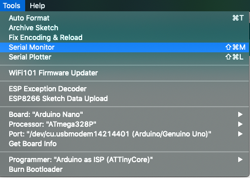
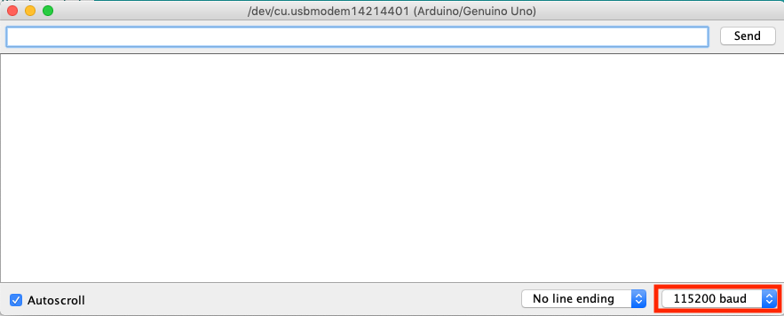

# Installation und Setup

Hier schauen wir uns erst einmal an welche Software wir brauchen um mit dem Arduino reden zu können und welche Bibliotheken wir installieren müssen damit wir später auch mit den LEDs reden können und unsere Beispiele ausführen können.

## Installation der Arduino IDE

Um mit einem Arduino arbeiten zu können benötigen wir eine Entwicklungsumgebung oder IDE, die es uns erlaubt die Befehle für den Arduino aufzuschreiben und an den Arduino zu senden.
Dazu laden wir die Arduino IDE von [www.arduino.cc](https://www.arduino.cc/en/Main/Software) herunter und installieren diese.
Wählt dazu das euer Betriebssystem aus der Auswahl aus.


Danach öffnet ihr einfach die Arduino IDE wie ihr es von eurem Betriebssystem gewohnt seid.

## Installation der Bibliotheken

Eine Bibliothek oder library ist eine Sammlung von vorgefertigten Befehlen für den Arduino, die es uns einfacher macht bestimmte Dinge mit einem Arduino zu machen. Wenn ihr weiter mit dem Arduino arbeitet werdet ihr noch viel mit Bibliotheken arbeiten, da sich viele Menschen die Zeit nehmen Bibliotheken zu schreiben um es sich selbst und anderen Menschen einfacher zu machen bestimmte Dinge mit einem Arduino zu verwenden.
Bibliotheken können es euch einfacher machen bestimmte Sensoren auszulesen oder Dinge wie Motoren oder LEDs zu steuern, indem die komplexen Abläufe in der Bibliothek definiert sind und für euch ganz einfach zur Verfügung gestellt werden.
Das tolle an der Open Source Philosophie ist aber, dass ihr auch nachschauen könnt was intern in der Bibliothek gemacht wird, wenn euch interessiert wie bestimmte Sachen funktionieren. So könnt ihr sehr viel lernen aber auch selbst Fehler finden und beheben oder neue Sachen einbauen.

### Der Library Manager

Um eine bekannte Bibliothek zu installieren öffnet ihr einfach den Library Manager `Sketch|Bibliothek einbinden|Bibliotheken verwalten` und sucht nach der Bibliothek mit dem entsprechenden Namen.

Wir werden die [FastLED](https://github.com/FastLED/FastLED) library verwenden um mit den LEDs zu kommunizieren, deshalb suchen wir nach der `FastLED` Bibliothek.


### Bibliothek manuell hinzufügen

Man kann Bibliotheken auch manuell hinzu fügen. Um unsere Beispiele später ausführen zu können müssen wir diese Bibliothek installieren. Dazu wechseln wir in den Bibliotheksordner der Arduino IDE. Dieser liegt für jedes Betriebssystem an einer anderen Stelle.

* **MacOs** `~/Documents/Arduino/libraries`
* **Linux** `~/sketchbook/libraries`
* Windows `C:\<Benutzername>\Arduino\libraries`

Nun können wir die Bibliothek entweder mit Git über ssh auschecken:
```
git clone git@github.com:nomeme/JugendHackt-Animation-Lib.git
```
wenn ihr einen [Github](https://www.github.com) Account habt.
Oder über https, wenn ihr keinen Account habt:
```
git clone https://github.com/nomeme/JugendHackt-Animation-Lib.git
```

Solltet ihr kein git haben könnt ihr auch einfach die zip Datei von [hier](https://github.com/nomeme/JugendHackt-Animation-Lib/archive/master.zip) herunterladen und dann im passenden Ordner entpacken.

Nun müsst ihr nur noch die Arduino IDE neu starten und wir können los legen.

# Hello World

Zu aller erst schauen wir uns mal an wie man so einem Arduino eigentlich sagen kann was er tun soll. Wenn wir einem Arduino sagen wollen was er tun soll dann erstellen wir einen sogenannten Sketch. Ein Sketch ist eine Abfolge von Befehlen für den Arduino.

## Arduino Anschließen

Steckt einfach das mini USB Kabel in den Arduino und danach das andere Ende in euren Computer.
Habt ihr alles richtig gemacht sollten ein paar LEDs zu leuchten beginnen.

## Unser erster Sketch

Ein Sketch hat immer eine sogenannte `setup` Methode und eine `loop` Methode.
Die `setup` Methode verwenden wir um Einstellungen vor zu nehmen bevor das eigentliche Programm ausgeführt wird.
Die `loop` Methode verwenden wir um unsere eigentlichen Aufgaben für den Arduino aufzuschreiben. Alles was in der `loop` Methode steht macht der Arduino immer und immer wieder, bis wir ihn vom Strohm nehmen.

Die Befehle arbeitet der Arduino immer von oben nach unten ab.
Das ganze sieht dann zum Beispiel so aus:

```C
void setup() {
  Serial.begin(115200);// Wir aktivieren die Serielle Schnittstelle
  delay(1000);// Wir warten eine Sekunde.
  Serial.println("Hallo");// Wir übertragen die Textzeile Hallo an unseren Computer.
}


void loop() {
  Serial.print("Hallo");// Wir übertragen den Text Hallo an unseren Computer
  delay(3000); // Wir warten drei sekunden
  Serial.println(" Welt"); // Wir übertragen den Text Welt an unseren Computer und beenden die Zeile.
  delay(3000);// Wir warten drei sekunden
}
```

Hier könnt ihr die beiden Methoden `setup()` und `loop()` sehen.
In diesen Methoden stehen dann die Befehle für den Arduino. Jeder Befehl endet mit einem `;`.

Um euch zu erklären was dieser Befehl mach habe ich dahinter ein Kommentar geschrieben. Die Kommentare sind alles was hinter dem `//` steht. Sie werden vom Arduino ignoriert und dienen nur dazu euch zu erklären was in der jeweiligen Zeile passiert.

Den Sketch öffnet ihr über `Datei|Beispiele|JugendHacktAnimation|Sketch`.
Danach sollte ein Fenster mit den Arduino Befehlen auftauchen. 

### Sketch auf den Arduino spielen

#### Board auswählen

Zuerst müssen wir das korrekte Arduino board auswählen. Da es mittlerweile viele verschiedene und ganz unterschiedliche Arduinos gibt ist es wichtig immer das korrekte board auszuwählen, weil das ganze sonst am Ende nicht funktioniert.


#### Port auswählen

Im nächstn Schritt müssen wir der Arduino IDE sagen an welchem port der Arduino hängt.


#### Seriellen Monitor öffnen

Damit wir auch Daten vom Arduino bekommen müssen wir den Seriellen monitor öffnen. Der zeigt uns dann an, was uns der Arduino so schickt.



Damit wir die Daten auch korrekt empfangen müssen wir noch die Übertragungsrate einstellen. Die muss auf dem Arduino und deinem Computer gleich sein.
Im Sketch haben wir sie mit `Serial.begin(115200)` auf `115200` eingestellt. Das müssen wir nun im Seriellen Monitor auch tun.



#### Daten auf den Arduino übertragen

Wenn wir jetzt den `Upload` Knopf drücken werden die Befehle übersetzt und zum Arduino geschickt.


Danach können wir im Seriellen Monitor anschauen was uns der Arduino schickt.


Glückwunsch, du hast jetzt deinen ersten Sketch auf einen Arduino geladen. Spiele doch ein bisschen mit den Befehlen herum.
Verändere den Text oder die Wartezeit und schau was passiert.
Viel spass mit deinem ersten Sketch.

# Aufbau

Wir haben ein Steckbrett, einen Arduino Nano und einen LED ring. Diese schließen wir wie in der Abbildung gezeigt an.
Fasst den Arduino und den LED ring bitte nur an der Seite an, da es sich hier um empfindliche Elektronik handelt und ihr den Arduino schnell kaputt machen könnt wenn ihr ihn an den elektronischen Teilen berührt.


Solltet ihr einen Arduino Uno haben könnt ihr den natürlich auch verwenden. Die Anschlüsse bleiben die Gleichen. Nur die Position der Anschlüsse unterscheidet sich.


Der Anschluss des Pixel-Rings an dem `VCC` steht muss mit dem `5V` Anschluss des Arduino verbunden werden.
Der Anschluss des Pixel-Rings an dem `GND` steht muss mit dem `GND` Anschluss am Arduino verbunden werden.
Zuletzt verbinden wir den `DIN` Anschluss am Pixel-Ring mit dem Anschluss `6` am Arduino.

# Weitere Schritte.

Wie geht es jetzt weiter? Wir wissen nun, wie wir einen Sketch auf den Arduino übertragen können.
Wenn das alles für euch neu ist, dann schaut doch im Kapitel [Grundlagen](Grundlagen.md) vorbei. Dort lernen wir alles was wir in den weitern Kapiteln brauchen.
Wenn ihr schon etwas mehr wisst, dann könnt ihr auch direkt mit dem Kapitel [Von Farben und Physik](Farben.md) los legen. Ich werde euch immer wieder auf die passenden Teile des Grundlagenkapitels hinweisen, wenn wir neue Dinge ausprobieren.

---

[Anfang](../Readme.md) | [Grundlagen](Grundlagen.md) | [Von Farben und Physik](Farben.md)

---

[Anfang](../Readme.md) | [Setup](Setup.md) | [Grundlagen](Grundlagen.md) | [Von Farben und Physik](Farben.md) | [Animationen](Animation.md)

